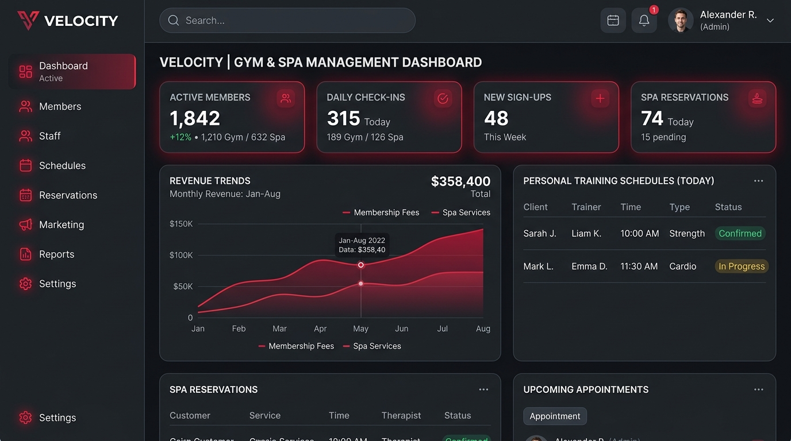
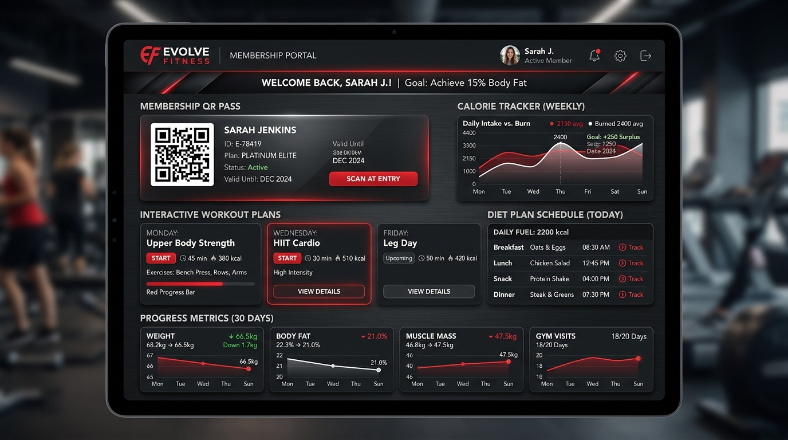

<div align="center">

# 🏋️‍♂️ VIKINGS GYM & SPA

### *Enterprise-Grade Fitness & Wellness Center Management Platform*

[](https://vikingsgymspa.vercel.app)
[](https://vikings-gym-backend.onrender.com)
[](https://react.dev/)
[](https://flask.palletsprojects.com/)
[](https://www.mongodb.com/atlas)
[](https://www.typescriptlang.org/)

<br />



</div>

---

## 📖 Overview

**Vikings Gym & Spa** is a modern, full-stack management web application built specifically for luxury fitness clubs, wellness centers, and multi-branch gyms. It features a dark-themed UI, real-time analytics, automated membership notifications, digital QR check-in passes, personal training scheduling, and inventory/equipment maintenance tracking.

- 🌐 **Live Frontend Application**: [https://vikingsgymspa.vercel.app](https://vikingsgymspa.vercel.app)
- ⚙️ **Live Backend API**: [https://vikings-gym-backend.onrender.com](https://vikings-gym-backend.onrender.com)

---

## 🌟 Key Features

### 👑 Admin & Operations Console
- **Multi-Branch Analytics**: Track revenue trends, member sign-ups, and active check-ins across locations.
- **Role-Based Access Control (RBAC)**: Distinct permission tiers for `SUPER_ADMIN`, `BRANCH_ADMIN`, `TRAINER`, and `MEMBER`.
- **Member Directory & Subscriptions**: Create and manage membership tiers (Silver, Gold, Platinum, VIP Spa Access) with automated renewal tracking.
- **Financials & Payment Gateways**: Invoice generation, expense logs, and Razorpay payment link integration.
- **Inventory & Equipment Service Alerts**: Automated low-stock inventory alerts and scheduled equipment maintenance trackers.

### 🧘 Member & Wellness Portal
- **Digital Membership QR Pass**: Instant contactless check-in pass for gym entry.
- **Custom Workout & Diet Plans**: Interactive exercise cards, macro-nutrient targets, and daily progress logs.
- **Personal Trainer Scheduling**: Book 1-on-1 PT sessions and spa therapy slots.
- **Progress Metrics**: Track body composition changes (weight, body fat %, muscle mass) over time.

<br />

<div align="center">



</div>

---

## 🏗️ Tech Stack & Architecture

### **Frontend**
- **Framework**: React 19 + Vite 6
- **Language**: TypeScript
- **Styling**: Modern Vanilla CSS with dark mode tokens & glassmorphism
- **Icons**: Lucide React
- **Deployment**: [Vercel](https://vercel.com)

### **Backend**
- **Framework**: Flask 3.1 + MongoEngine (ODM)
- **Concurrency & WebSockets**: Gunicorn + Eventlet + Flask-SocketIO
- **Background Jobs**: APScheduler (Automated birthday wishes, expiry notices, inventory checks)
- **Security**: Flask-JWT-Extended, Flask-Bcrypt, Flask-CORS
- **Deployment**: [Render](https://render.com)

### **Database**
- **Database**: MongoDB Atlas (Cloud Cluster)

---

## 🚀 Quick Start (Local Development)

### **Prerequisites**
- **Node.js** (v18.x or higher)
- **Python** (v3.11.x or higher)
- **MongoDB** (Local instance or MongoDB Atlas Connection URI)

---

### **1. Clone the Repository**
```bash
git clone https://github.com/ritwikamit/Vikings-GYM-SPA.git
cd Vikings-GYM-SPA
```

---

### **2. Backend Setup**
```bash
# Navigate to backend directory
cd backend

# Create virtual environment
python -m venv venv

# Activate virtual environment
# Windows:
venv\Scripts\activate
# Linux/macOS:
source venv/bin/activate

# Install dependencies
pip install -r requirements.txt

# Create .env file in backend/ directory
cat <<EOT > .env
FLASK_ENV=development
SECRET_KEY=dev-secret-key-change-me
JWT_SECRET_KEY=dev-jwt-secret-change-me
MONGODB_URI=mongodb://localhost:27017/vikings_gym
FRONTEND_URL=http://localhost:5173
PORT=5000
EOT

# Run Flask server
python run.py
```
*Backend runs locally at `http://localhost:5000`.*

---

### **3. Frontend Setup**
```bash
# From project root directory
npm install

# Create .env.local file in root directory
cat <<EOT > .env.local
VITE_API_URL=http://localhost:5000/api
EOT

# Start Vite development server
npm run dev
```
*Frontend runs locally at `http://localhost:5173`.*

---

## 🔑 Default Credentials (Seeded Admin)

For local testing or administrative access:

| Role | Email | Password |
|---|---|---|
| **Super Admin** | `admin@vikingsgym.in` | `Admin@123` |

---

## 🔌 API Route Reference

| Endpoint | Method | Description | Access |
|---|---|---|---|
| `/api/auth/login` | `POST` | User login & JWT issuance | Public |
| `/api/auth/register` | `POST` | Member self-registration | Public |
| `/api/auth/me` | `GET` | Get current user profile | Authenticated |
| `/api/members` | `GET`, `POST` | Manage member records | Admin / Staff |
| `/api/memberships` | `GET`, `POST` | Membership plans & subscriptions | Admin / Staff |
| `/api/attendance` | `GET`, `POST` | Attendance logs & QR check-ins | Admin / Staff |
| `/api/workouts` | `GET`, `POST` | Workout plan assignments | All Users |
| `/api/diet` | `GET`, `POST` | Diet and nutrition plans | All Users |
| `/api/analytics` | `GET` | Financial & membership analytics | Super Admin |

---

## 🛠️ Deployment Configuration

- **Frontend (Vercel)**: `vercel.json` rewrites single-page application routes to `index.html`. `VITE_API_URL` set to Render endpoint.
- **Backend (Render)**: `render.yaml` specifies root directory `backend/`, build command `pip install -r requirements.txt`, and start command `gunicorn --worker-class eventlet -w 1 run:app`.

---

## 📄 License

This project is licensed under the [MIT License](LICENSE).

<div align="center">
  <sub>Built with ❤️ for Vikings Gym & Spa</sub>
</div>
